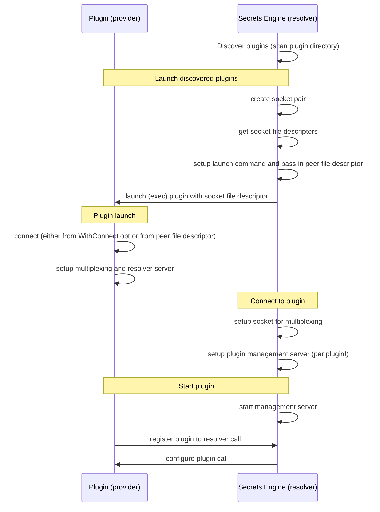

# The Plugin System
The secrets engine acts as a server that manages plugins. 
I.e., plugins register themselves as clients to the server.
Each plugin also is a server that handles resolver requests from the secrets engine.

## Plugin initialization flow
By default, plugins are discovered by scanning the plugin directory for executables and then launched by the secrets engine.
Alternatively, plugins can be started on their against an already running secrets engine (they then would re-use the default socket and register themselves with the secrets engine).
