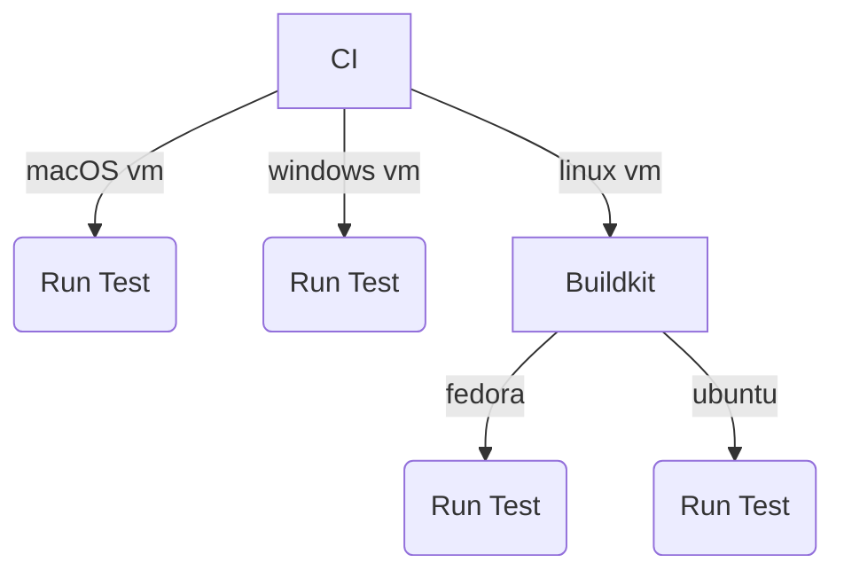
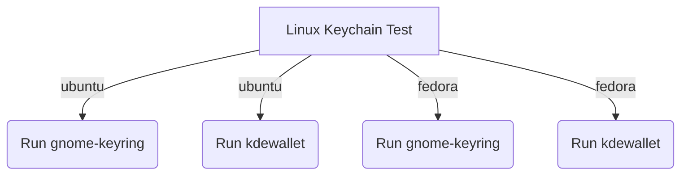

# Keychain CI

The keychain tests are split between macOS, Linux and Windows. There are two
make commands: `make keychain-unit-tests` and `make keychain-linux-unit-tests`.

Since there are so many different scenarios in Linux, the GH runners would
be a headache to setup and maintain and we don't have access to the necessary
variety of distros.

Linux has two popular keychain backends: `gnome-keyring-daemon` and `kdewallet`.
To cover a variety of environments, we run `Ubuntu` and `Fedora` tests using
Docker with different keychain backend.

Each keychain backend has a script to start them up and ensure they are running
before any Go tests even run. They are located in `store/scripts/gnome-keyring`
and `store/scripts/kdewallet`.

### Fedora

We require `dbus-daemon` since it was removed in favor of `dbus-broker` over
`systemd`. We then use `dbus-daemon` to start the `dbus` service and get the
connection address for `gnome-keyring` and `kwalletd6`.

### Ubuntu

We require `libglib2.0-bin` since we require `gdbus` CLI to talk to the `dbus`
APIs.

## Understand the Process

The GitHub action spins up three jobs, `linux-keychain`,`test-macos` and `test-windows`.
Each job is run in its own runner. For example `test-macos` runs inside a `macos`
runner. The Linux job is run on an Ubuntu runner, but the actual tests are run
through Docker Buildkit.

For `linux-keychain` we then have four tests:

- `ubuntu-24-gnome-keyring`
- `ubuntu-24-kdewallet`
- `fedora-43-gnome-keyring`
- `fedora-43-kdewallet`

Each test uses `buildkit` to setup a base image layer specified in `store/Dockerfile`.
There are two base image layers `ubuntu-24.04` and `fedora-43`. They install
all the necessary packages which gives us caching.

Then for each of the four tests listed above we invoke the relevant scripts stored
in `store/scripts`.

On a high-level, each script does:

1. Check relevant binaries available
2. Creates the necessary files for the keyring daemon
3. Starts the dbus daemon
4. Sets the `DBUS_SESSION_BUS_ADDRESS` environment variable
5. Starts the keyring
6. Waits for the keyring to be active by polling dbus over `gdbus`
7. Check if the registered `org.freedesktop.secrets` backend matches what we expect.
