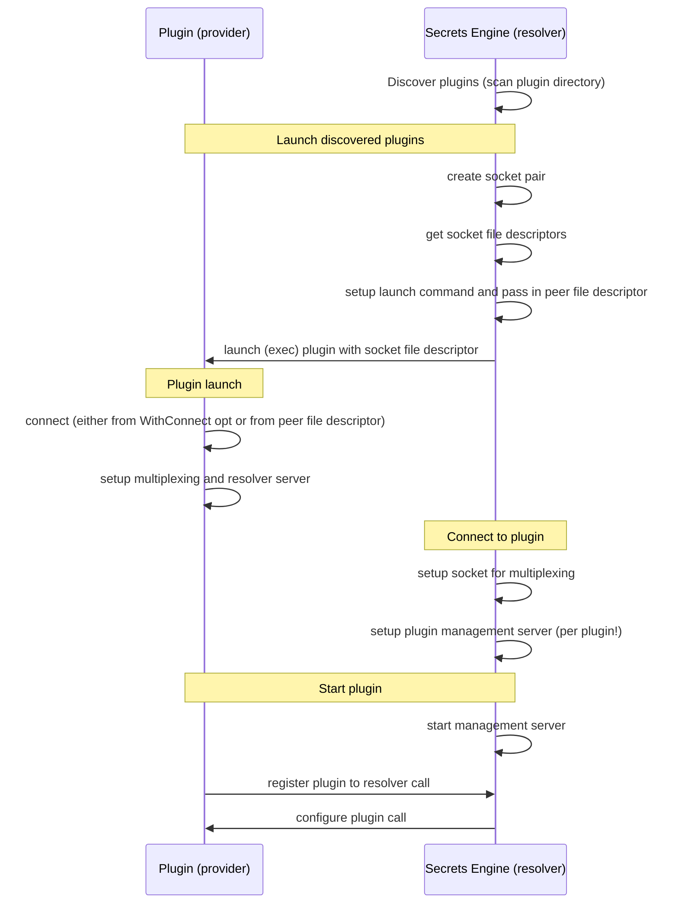

# The Plugin System

The secrets engine acts as a server that manages plugins.
I.e., plugins register themselves as clients to the server.
Each plugin also is a server that handles resolver requests from the secrets engine.

## Plugin initialization flow

By default, any plugin can be discovered by scanning the plugin directory for
executables and then launched by the secrets engine. In the case where a plugin
is already known to the secrets engine (e.g. docker CLI), it can discover
the plugin via the System Path.

Alternatively, a plugin can make themselves known to an already running secrets
engine by reusing the default socket.

