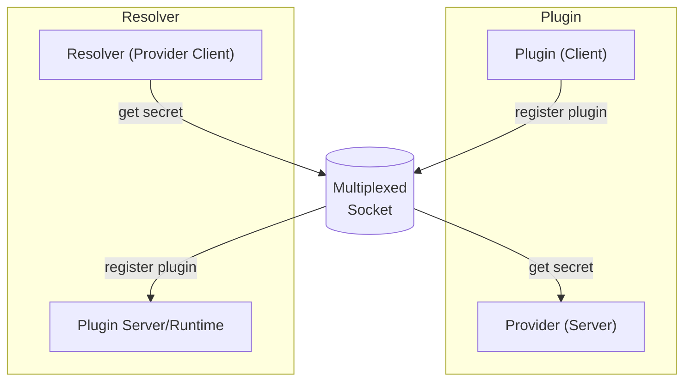

# IPC and multiplexing a socket
The plugin system has two parts:
- the runtime: launches plugins or allows manual launched plugins to connect
- the plugin(s): registers to the runtime and is domain expert for a specific secret provider

From the plugin system perspective, the runtime is a lifecycle management server for plugins.
However, from the secrets engine perspective, the runtime is a client that can request secrets from a plugin.

To avoid having a socket per plugin, we multiplex the socket.

## Decisions

---

### 2025-07-02 settling on yamux + connect rpc for the IPC stack

The IPC stack consists of multiple parts that need to play well together:
- socket multiplexing
- API format (includes networking protocol + serialization format)

At this point in time we have decided to go with yamux + connect rpc. 
Connect rpc in itself uses protobuf for data serialization combined with gRPC over http for networking.
A main advantage is that we can keep using Go's standard library's `net/http` stack for server and client.
See [Connect: A better gRPC](https://buf.build/blog/connect-a-better-grpc) for a detailed comparison against e.g.`grpc-go`.
Also connect rpc is part of CNCF ([source](https://www.cncf.io/projects/connect-rpc/)).

Potential drawbacks: Performance

Using [nri/net/multiplex](https://github.com/containerd/nri/tree/main/pkg/net/multiplex) with [ttrpc](https://github.com/containerd/ttrpc) probably would be the most performant solution.
It re-uses one stream over the multiplexed socket per direction and does not have the overhead of the HTTP protocol as Protobuf gets streamed directly over the multiplexer.
Although lightweight, it has stopped evolving and has not caught up to the latest improvements on Protobuf.
Another major downside is that it's mainly Go only. 
Plugins written in a different language would come at a high cost.

We argue that in our use case since the networking only happens locally the overhead of GRPC over HTTP and the cost of opening a new yamux stream per API request are negligible. 
In addition, the main performance bottleneck will be within the actual plugins due to IO operations, additional upstream network requests and potentially authentication.

---

### 2025-06-27 dropping nri/net/multiplex in favor of yamux

The multiplexer adds a custom layer on top of the socket that allows running servers on both ends of the socket.

#### nri/net/multiplex - a minimal multiplexer

The plugin system in [containerd/nri](https://github.com/containerd/nri) implements its own simple frame-based multiplexer [nri/net/multiplex](https://github.com/containerd/nri/tree/main/pkg/net/multiplex).
It provides two streams on each side that need to be re-used for all communication.
This works well for [ttrpc](https://github.com/containerd/ttrpc) which uses its own length-prefixed framing.
However, the standard Go HTTP server inside `Server(net.Listener)` does one `Accept()`, gets one `net.Conn`, and then loops inside serveConn to decode requests.
I.e. it tries to create (and on completion closes) a new stream per request but using nri/net/multiplex gets stuck as nri/net/multiplex is only design to return one stream per lifetime.

Alternatively, HTTP/2 without TLS could be used as it gives control over the framing.
Unfortunately, Go's `net/http` package does not easily support HTTP/2 without TLS and getting it to work comes with its own set of challenges, such as requiring a custom `net.Listener` implementation that handles the HTTP/2 framing.

TLDR: [nri/net/multiplex](https://github.com/containerd/nri/tree/main/pkg/net/multiplex) is not ideal for general HTTP servers.

#### Yamux

Yamux is a full-featured, multiplexing protocol that allows multiple streams to be sent over a single TCP connection. It is actively maintained by Hashicorp and is used by Hashicorp's Nomad.
Using Yamux we get Go's `net/http` out-of-the-box.

---

