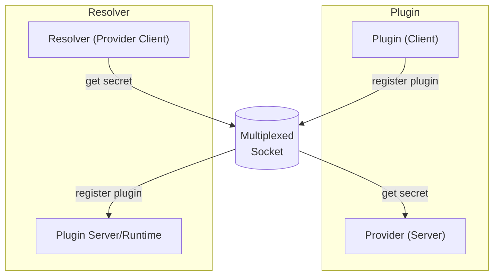

# IPC and multiplexing a socket
The plugin system has two parts:
- the runtime: launches plugins or allows manual launched plugins to connect
- the plugin(s): registers to the runtime and is domain expert for a specific secret provider

From the plugin system perspective, the runtime is a lifecycle management server for plugins.
However, from the secrets engine perspective, the runtime is a client that can request secrets from a plugin.

To avoid having a socket per plugin, we multiplex the socket.

## Choosing a multiplexer
The multiplexer adds a custom layer on top of the socket that allows running servers on both ends of the socket.

### nri/net/multiplex - a minimal multiplexer
The plugin system in [containerd/nr](https://github.com/containerd/nri) implements its own simple frame-based multiplexer [nri/net/multiplex](https://github.com/containerd/nri/tree/main/pkg/net/multiplex). 
It provides two streams on each side that need to be re-used for all communication.
This works well for [ttrpc](https://github.com/containerd/ttrpc) which uses its own length-prefixed framing.
However, the standard Go HTTP server inside `Server(net.Listener)` does one `Accept()`, gets one `net.Conn`, and then loops inside serveConn to decode requests. 
But because that sub-connection isn’t a real socket—and because the mux delivers no further “new connections” and any pipelined data after the first request can get lost or stuck in the mux’s framing, and the server never sees it.

Alternatively, HTTP/2 without TLS could be used as it gives control over the framing.
Unfortunately, Go's `net/http` package does not easily support HTTP/2 without TLS and getting it to work comes with its own set of challenges, such as requiring a custom `net.Listener` implementation that handles the HTTP/2 framing.

TLDR: [nri/net/multiplex](https://github.com/containerd/nri/tree/main/pkg/net/multiplex) is not ideal for general HTTP servers.

### Yamux

Yamux is a full-featured, multiplexing protocol that allows multiple streams to be sent over a single TCP connection. It is actively maintained by Hashicorp and is used by Hashicorp's Nomad.
Using Yamux we get Go's `net/http` out-of-the-box.

