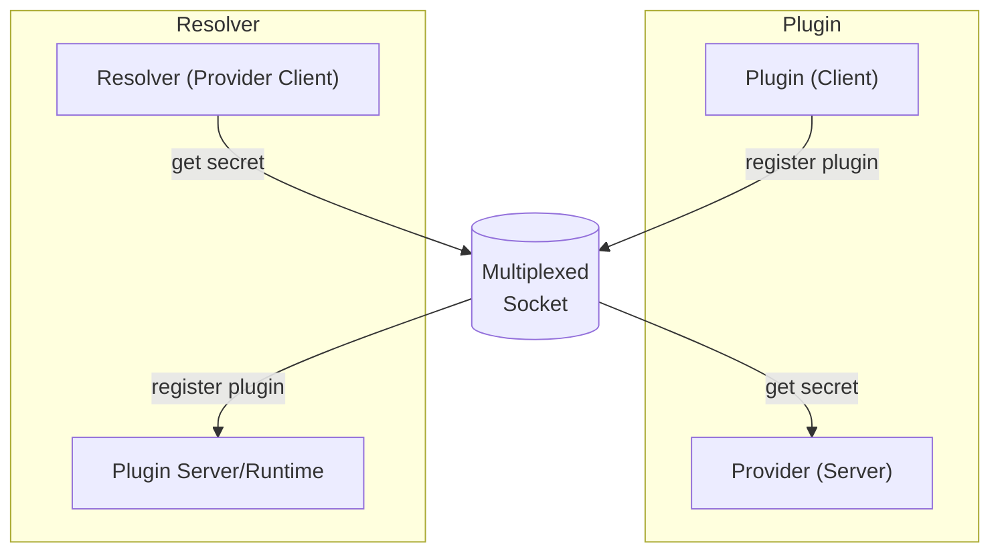

# IPC and multiplexing a socket
The plugin system has two parts:
- the runtime: launches plugins or allows manual launched plugins to connect
- the plugin(s): registers to the runtime and is domain expert for a specific secret provider

From the plugin system perspective, the runtime is a lifecycle management server for plugins.
However, from the secrets engine perspective, the runtime is a client that can request secrets from a plugin.

To avoid having a socket per plugin, we multiplex the socket.

## Decisions

---

### 2025-07-31 Doing Hijacking Logic (the right way)

There was a bug in the engine's ipc handler which caused intermittent plugin registration failures. 
The CI became extremely flaky which indicated that there was an underlying problem.
The core issue is that hijacking in `net/http.Server` would intermittently drop the connection which the plugin establishes. 
The cause was a mixture of undocumented lifecycle behavior of the underlying `net.Conn` that was hijacked from connection in `net/http.Server` and a missing first byte from the payload sent by the client (possibly).

The main takeaways are:
- The hijacked `net.Conn` is only guaranteed to be valid while the request handler hasn't returned. I.e., we need to make it wait for the code using it to finish before returning the request handler. Ownership of net.Conn can't be transferred out of the request handler as previously assumed.
- The response header needs to be written **after** the hijack.

Also studying [the standard lib reverseproxy](https://github.com/golang/go/blob/880ca333d708b957325b6ef4798699372d4c090e/src/net/http/httputil/reverseproxy.go#L768-L804) helped a lot to understand how to implement hijacking on the server correctly.

Related issues:
- [net/http: first byte of second request in hijack mode is lost golang/go#27408](https://github.com/golang/go/issues/27408)
- [net/http: reading from hijacked bufio.Reader should not cause r.Context to be cancelled golang/go#32314](https://github.com/golang/go/issues/32314)

---

### 2025-07-15 Windows IPC: Using a pair of uni-directional pipes

On windows, there are at least 3 different ways to achieve IPC that's equivalent to a socket+2fd on unix:
- Using a pair of [pipes](https://learn.microsoft.com/en-us/windows/win32/ipc/pipes) and combining them into a duplex communication channel.
- Using [Windows Sockets 2](https://learn.microsoft.com/en-us/windows/win32/api/winsock2/)
- Using bidirectional [named pipes](https://learn.microsoft.com/en-us/windows/win32/ipc/named-pipes)

#### Understanding our requirements: bidirectional communication + pair of inheritable handlers/FDs
The engine requires that communication between itself and the plugin have anonymity and robust inheritance.
Anonymity helps avoid clashes with other applications/services running on the host. Inheritance is the process of passing along the required information to a child process (i.e. a plugin) so that it can setup IPC back to the engine.
That means:
- No ports: Ports are a potential hassle with firewalls and can conflict with other programs/services. There are also security gaps as anyone can interfere with them.
- No filepaths: They have the same drawbacks that ports have.
- File descriptors / handlers: If we don't want to rely on ports or paths, inheritance is achieved by getting the underlying OS primitives (file descriptors or handlers) and passing one end to the child process.
See also [Time to use AF_UNIX](https://lwn.net/Articles/984841/) article on LWN.net for related discussion.

#### The tradeoffs (Windows)

On Linux and macOS, sockets with file descriptors are supported.
On Windows it is unfortunately a bit more complicated.

Winsock2 comes closest to what we ideally need. It's effectively available on all supported Windows version (and unsupported from Windows 7) and is used in the Go standard library. Unfortunately, despite the [announcement](https://devblogs.microsoft.com/commandline/af_unix-comes-to-windows/), **Windows does not implement abstract sockets**. Winsock2 always binds to a port and if not explicitly set the next available one will be assigned by the OS. More information on the topic can be found in this [WSL issue](https://github.com/microsoft/WSL/issues/4240).

Named pipes: They always require a name. Based on the sources of [go-winio](https://github.com/microsoft/go-winio) it seems that there might be a possibility to use that technology with handlers only, but unfortunately it's neither documented nor implemented.

A pair of win32 pipes: They are anonymous and inheritable, however, lack the _atomic removal_ property we need to close both at the same time. Fortunately, we can work around it and would be the best choice based on what is currently supported.

---

### 2025-07-02 settling on yamux + connect rpc for the IPC stack

The IPC stack consists of multiple parts that need to play well together:
- socket multiplexing
- API format (includes networking protocol + serialization format)

At this point in time we have decided to go with yamux + connect rpc. 
Connect rpc in itself uses protobuf for data serialization combined with gRPC over http for networking.
A main advantage is that we can keep using Go's standard library's `net/http` stack for server and client.
See [Connect: A better gRPC](https://buf.build/blog/connect-a-better-grpc) for a detailed comparison against e.g.`grpc-go`.
Also connect rpc is part of CNCF ([source](https://www.cncf.io/projects/connect-rpc/)).

Potential drawbacks: Performance

Using [nri/net/multiplex](https://github.com/containerd/nri/tree/main/pkg/net/multiplex) with [ttrpc](https://github.com/containerd/ttrpc) probably would be the most performant solution.
It re-uses one stream over the multiplexed socket per direction and does not have the overhead of the HTTP protocol as Protobuf gets streamed directly over the multiplexer.
Although lightweight, it has stopped evolving and has not caught up to the latest improvements on Protobuf.
Another major downside is that it's mainly Go only. 
Plugins written in a different language would come at a high cost.

We argue that in our use case since the networking only happens locally the overhead of GRPC over HTTP and the cost of opening a new yamux stream per API request are negligible. 
In addition, the main performance bottleneck will be within the actual plugins due to IO operations, additional upstream network requests and potentially authentication.

---

### 2025-06-27 dropping nri/net/multiplex in favor of yamux

The multiplexer adds a custom layer on top of the socket that allows running servers on both ends of the socket.

#### nri/net/multiplex - a minimal multiplexer

The plugin system in [containerd/nri](https://github.com/containerd/nri) implements its own simple frame-based multiplexer [nri/net/multiplex](https://github.com/containerd/nri/tree/main/pkg/net/multiplex).
It provides two streams on each side that need to be re-used for all communication.
This works well for [ttrpc](https://github.com/containerd/ttrpc) which uses its own length-prefixed framing.
However, the standard Go HTTP server inside `Server(net.Listener)` does one `Accept()`, gets one `net.Conn`, and then loops inside serveConn to decode requests.
I.e. it tries to create (and on completion closes) a new stream per request but using nri/net/multiplex gets stuck as nri/net/multiplex is only design to return one stream per lifetime.

Alternatively, HTTP/2 without TLS could be used as it gives control over the framing.
Unfortunately, Go's `net/http` package does not easily support HTTP/2 without TLS and getting it to work comes with its own set of challenges, such as requiring a custom `net.Listener` implementation that handles the HTTP/2 framing.

TLDR: [nri/net/multiplex](https://github.com/containerd/nri/tree/main/pkg/net/multiplex) is not ideal for general HTTP servers.

#### Yamux

Yamux is a full-featured, multiplexing protocol that allows multiple streams to be sent over a single TCP connection. It is actively maintained by Hashicorp and is used by Hashicorp's Nomad.
Using Yamux we get Go's `net/http` out-of-the-box.

---

