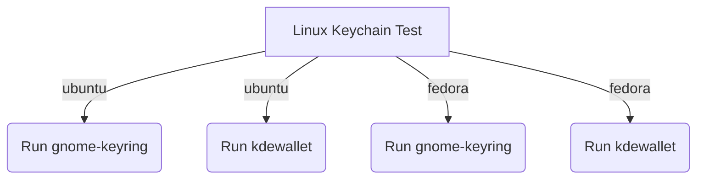

# Test

The store can be test using `go test`.

## Keychain tests

For local development, it would make the most sense to just run `keychain-unit-tests`
since it's simply invoking `go test` for only the `keychain` package. CGO is
enabled to support macOS.

To tests Linux on other OSs (like macOS and Windows) or isolated from the host,
you can use the `make keychain-linux-unit-tests` command.

```console
DOCKER_TARGET=ubuntu-24-gnome-keyring make keychain-linux-unit-tests
```

For Linux we then have four tests:



- `ubuntu-24-gnome-keyring`
- `ubuntu-24-kdewallet`
- `fedora-43-gnome-keyring`
- `fedora-43-kdewallet`

This will use `buildkit` to target only the `ubuntu-24-gnome-keyring` label inside
the `store/Dockerfile`.
